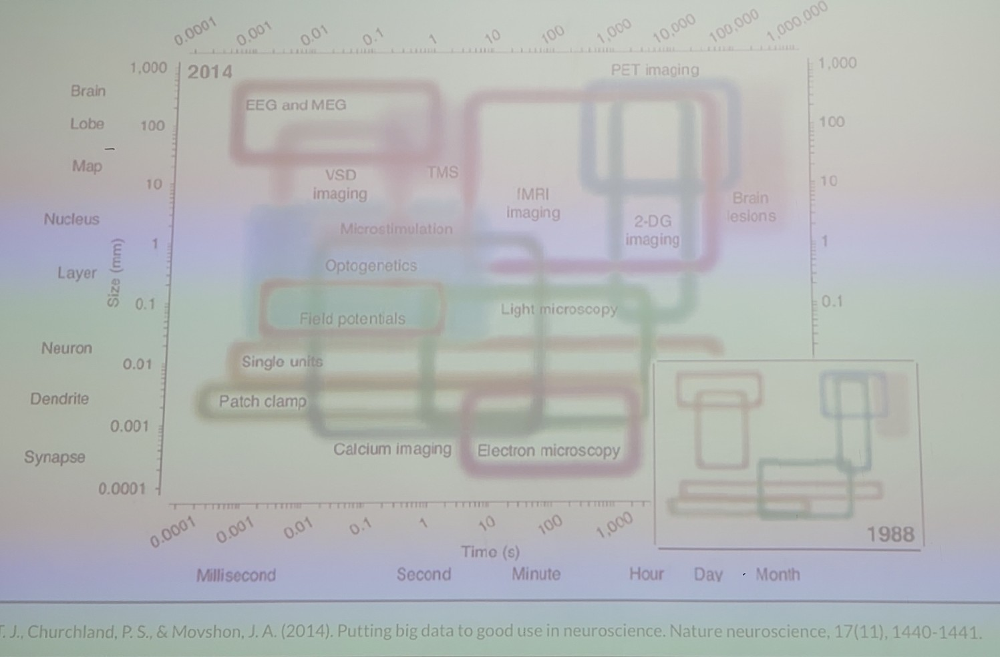
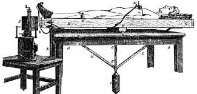
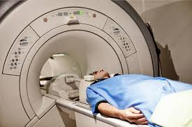
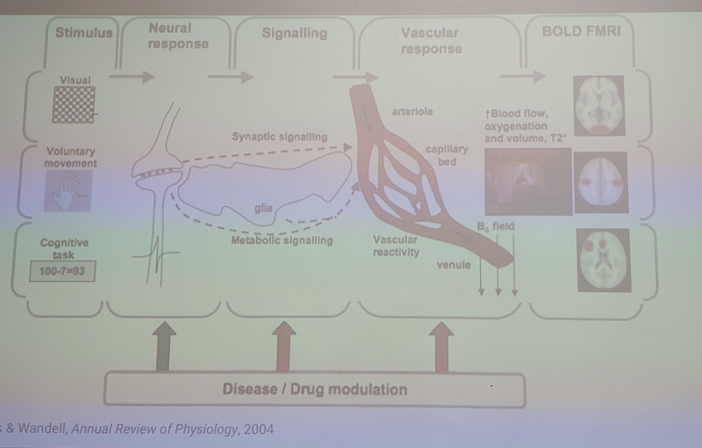
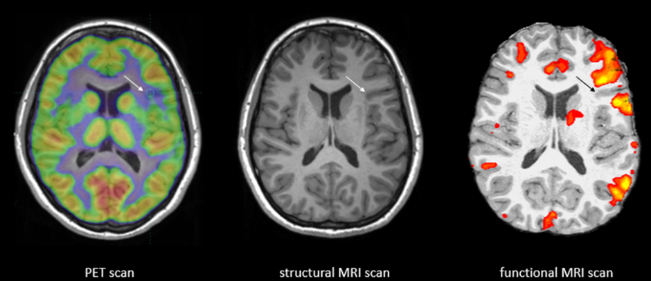
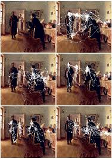
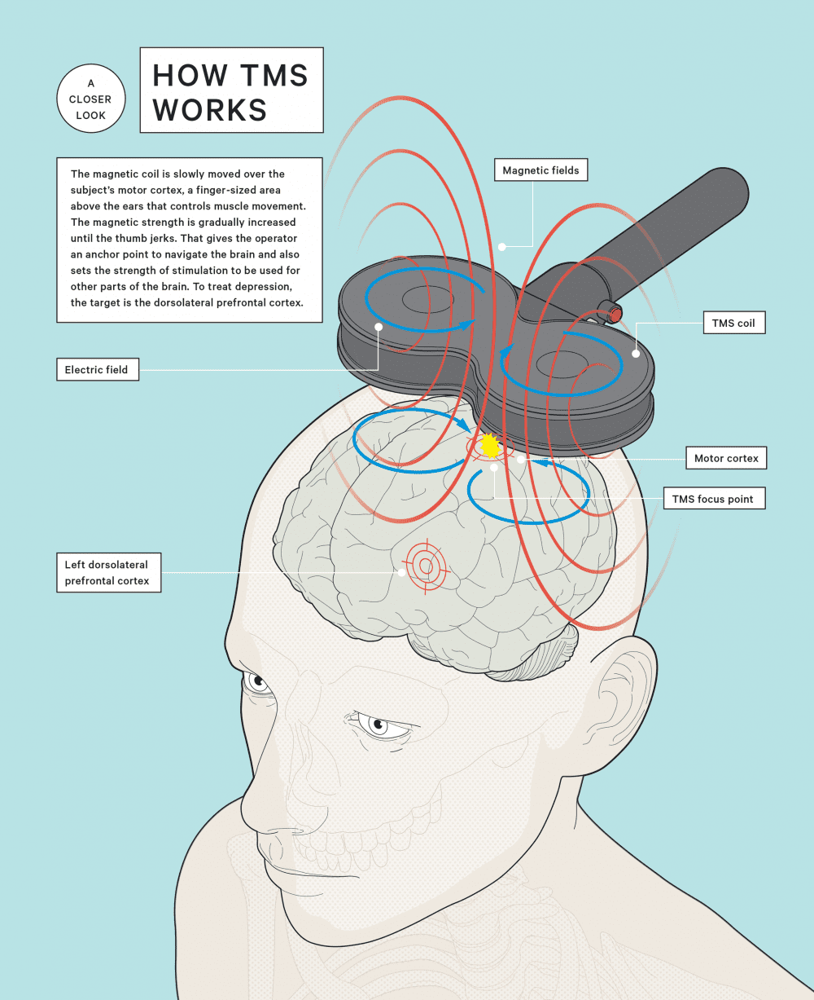

# sesion-03

2026-03-24

## métodos de analizar el cerebro y sus partes

### fMRI: Functional Magnetic Resonance Imaging

se dice que es uno de las principales fuentes de fake news neurocientíficas.

Consiste en una "foto".

Proviene de Angelo Mosso, creyente en el motabolismo. Pensaba que cuando piensas, tienes más sangre llendo a tu cabeza. Mosso creó el "human circulation balance".

Te equilibraba, y la hipótesis era que al pensar fuertemente te desbalanzarías. Se comprobó que no era cierta su hipótesis.

Años después se encontraron sus escritos y se recreó el text con herramientas y tecnología moderna. Se comprobó cierta su teoría, de que más estímulo, aumento el metabolismo en el cerebro.

De ahí nace el concepto de fMRI

consiste en un imán que genera un fuerza no presentes en la naturaleza

Cuando el cerebro está estimulado, comienza a "pedir" cosas propias del metabolismo: azpucar, oxígeno, etc. Y por tanto hay mayor actividad vascular. Conclusión: sí es cierta la hipótesis de Mosso

el fMRI no mide el cerebro, mide la actividad metabólica, en base a ello se asume la actividad cognitiva.

el fMRI "lanza" ondas electromagnéticas, y se analizan las reacciones físicas. Por ejemplo, si se demora 3segundos en cruzar la onda, es tejido blando, y si se demora 6 segundos es tejido duro.

aquí el neuro científico define la paleta de colores. Y es una gama de actividad, los colores son un código de color para el nivel de actividad(todas las partes están activas siempre, pero esto mide las partes activas por sobre el promedio).

dato: no se debe confiar en resultados salidos de antes de 2011, que fue cuando se resolvió un problema que hacía que se detectara actividad vascular en organismos muertos

### eye tracking

tiene orígenes a principios de 1900. En un inicio podrían haber sido máquinas de tortura. Te colocan una especie de lente de contacto, amarrado a un lápiz, y con ello registraban a dónde se miraba. Esto con el objetivo de entender dónde está tu atención.

Luego con la computación, se pudo hacer de manera no invasiva.

El primer eye tracker que nos permite conectar la cognición con los ojos, fue de Yarbus 1967. Consistía en una pintura

les decía que miraran libremente pintura, y registraba a dónde miraban.

Luego comenzaron tests con preguntas guía. Ejemplo, determine la situación socioeconómica de la familia. Con ello cambiaba totalmente lo que se detectaba en el eye tracker.

Esa fue la primera vez que vinculamos los estados mentales con movimientos oculares. Todo va a depender de la pregunta que a uno le hacen. 

La disciplina de hacer las preguntas correctas en este tipo de instancias se llama psicometría. Se dedica a generar instrumentos(no es infalible) de investigación cualitativa.

Existe la deseabilidad social, fenómeno de que la gente quiero calzar con el resto, se tiende a mentir en encuestas y otros, para ser incluido. Por esto el eyetracker es tan importante, porque con los ojos no se puede mentir.

- sacadas: el acto de mover el ojo de un lugar a otro. Son voluntarias e involuntarias, su planificación dura entre 100-1000ms, y duran entre 20-40
- fijaciones: donde detienes la mirada. duran entre 50-600ms

esto es difuso porque hay personas que consideran que solo hay fijaciones o solo scadas, etc.

#### el ojo

las células foto receptoras son muy caras metabólicamente. Hay un punto donde se centran las señales, llamado fovea, debemos ir moviendo los ojos para que le llegue bien la luz a la fovea.

La vascularidad del ojo está por encima de este, al mover los ojos vas como "echando pa los laos" las venas. Esas son las venitas que se ven en las ojos.

Los eyetracker modernos miden 3 cosas:

- posición X de la mirada
- posición en Y de la mirada
- dilatación de la pupila

#### TMS Transmagnetic Cranial Stimulation

Silvanus Thompson postulaba que se podría estimular áreas específicas del cerebro con ondas electromagnéticos.

Con la llegada de la computación se le pudo dar uso a esta máquina.

Lo que permitió apuntar la bovina en lugares específicos, para estudiar los resultados que esto genera en el cerebro. Y también para lograr consecuencias específicas

Se utiliza como tratamiento para la depresión

## relevantes

- [objetividad - humberto maturana](https://www.buscalibre.cl/libro-objetividad-un-argumento-para-obligar/9789569987281/p/52393843)